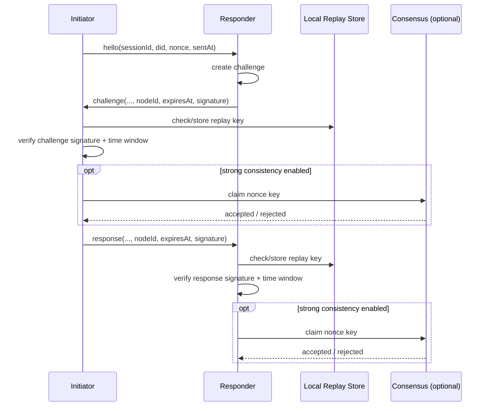
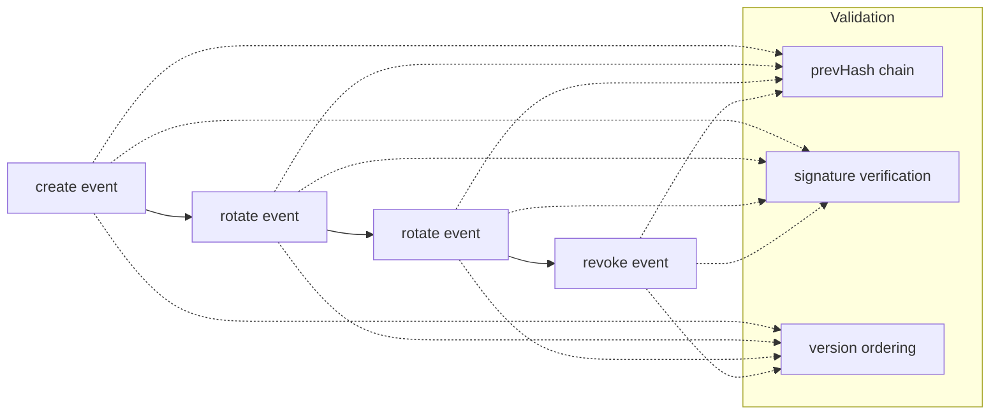

# mono-did

`mono-did` is a modular DID and handshake foundation extracted from Monoclaw.

It provides:

- Reusable identity and handshake semantics
- Local anti-replay checks plus a pluggable global nonce-claim interface
- DID key event log support (`create` / `rotate` / `revoke`)
- Stable adapters for Monoclaw, OpenClaw, or other runtimes

Default documentation language is English.

- Chinese version: [README.zh-CN.md](./README.zh-CN.md)

## Architecture

```mermaid
graph TD
  A[@mono/did aggregate package] --> B[@mono/did-core-types]
  A --> C[@mono/identity]
  A --> D[@mono/handshake]
  A --> E[@mono/protocol]
  A --> F[@mono/adapters]

  C --> G[DID:peer identity]
  C --> H[Key event log]

  D --> I[Challenge/response verification]
  D --> J[Local replay store]
  D --> K[Global nonce claim interface]

  K --> L[(Consensus layer: external)]
  H --> M[(Gossip transport: optional)]
```

## Design Boundary

`mono-did` defines protocol semantics and verification logic. It does **not** ship a built-in blockchain or BFT network.

- Without consensus: eventual consistency
- With external consensus: strong global consistency for nonce-claim and revocation finality

Responsibility split:

- `mono-did`: how events are signed, validated, and applied
- Consensus network: global ordering and finality

## Packages

```text
packages/
  mono-did         # Unified aggregate package (recommended public entry)
  did-core-types   # Core DID/handshake/event-log contracts
  mono-identity    # Identity creation, signing, DID event-log logic, gossip interface
  mono-handshake   # Challenge-response handshake + replay controls
  mono-protocol    # Transport constants + JSONL frame codec
  mono-adapters    # Stable integration interfaces
tests/unit         # Unit tests
```

## Core Capabilities

### DID Identity (`@mono/identity`)

- `createDidPeerIdentity`
- `resolveDidPeer2`
- `signPayload` / `verifyPayload`
- `createMultikeyFromPublicKeyPem` / `publicKeyPemFromMultikey`

### DID Key Event Log (`@mono/identity` + `@mono/did-core-types`)

- Event types: `create | rotate | revoke`
- Chained integrity: `version + prevHash + signature`
- Verification: `verifyDidKeyEventLog`
- Safe application: `applyDidKeyEvent`

### Handshake (`@mono/handshake`)

- `createServerChallengeFrame` / `createClientResponseFrame`
- `verifyServerChallengeFrameStrict` / `verifyClientResponseFrameStrict`
- Signature binding includes:
  - `sessionId`
  - `nonce`
  - `expiresAt`
  - `nodeId`
- Local anti-replay store: `MonoHandshakeReplayStore`
- External strong-consistency hook: `MonoHandshakeGlobalNonceClaimStore`

### Protocol (`@mono/protocol`)

- Protocol id: `/mono/handshake/1.0.0`
- JSONL frame codec: `encodeFrame` / `decodeFrame`

## Handshake Flow



## DID Key Event Lifecycle



## Installation

### Unified package (recommended)

```bash
npm i @mono/did
```

### Individual packages

```bash
npm i @mono/did-core-types @mono/identity @mono/handshake @mono/protocol @mono/adapters
```

## Quick Start

### Unified entrypoint

```ts
import { createDefaultMonoAdapters, createDidPeerIdentity } from '@mono/did';

const adapters = createDefaultMonoAdapters();
const identity = await createDidPeerIdentity();
```

### Identity + Handshake

```ts
import { createDidPeerIdentity, createNonce } from '@mono/identity';
import {
  InMemoryHandshakeReplayStore,
  createHandshakeSessionId,
  createServerChallengeFrame,
  createClientResponseFrame,
  verifyServerChallengeFrameStrict,
  verifyClientResponseFrameStrict,
} from '@mono/handshake';

const initiator = await createDidPeerIdentity();
const responder = await createDidPeerIdentity();
const replayStore = new InMemoryHandshakeReplayStore();

const hello = {
  type: 'hello' as const,
  version: 1 as const,
  sessionId: createHandshakeSessionId(),
  did: initiator.did,
  didDocument: initiator.document,
  nonce: createNonce(),
  sentAt: new Date().toISOString(),
};

const challenge = createServerChallengeFrame({
  hello,
  responderIdentity: responder,
  responderNonce: createNonce(),
});

const c = verifyServerChallengeFrameStrict({ hello, challenge }, { replayStore });
if (!c.ok) throw new Error(c.code);

const response = createClientResponseFrame({
  hello,
  challenge,
  initiatorIdentity: initiator,
});

const r = verifyClientResponseFrameStrict({ hello, challenge, response }, { replayStore });
if (!r.ok) throw new Error(r.code);
```

### DID key event log

```ts
import {
  createDidPeerIdentity,
  createDidKeyEventLog,
  appendDidRotateKeyEvent,
  appendDidRevokeKeyEvent,
  verifyDidKeyEventLog,
} from '@mono/identity';

const identity = await createDidPeerIdentity();

let log = createDidKeyEventLog(identity, { nodeId: 'node-a' });

log = appendDidRotateKeyEvent(
  log,
  identity,
  { publicKeyMultibase: identity.publicKeyMultibase, keyId: `${identity.did}#key-next` },
  { nodeId: 'node-a', reason: 'scheduled-rotation' },
);

log = appendDidRevokeKeyEvent(log, identity, {
  nodeId: 'node-a',
  reason: 'identity-decommissioned',
});

const verification = verifyDidKeyEventLog(log);
if (!verification.ok) throw new Error(`${verification.code}: ${verification.message}`);
```

### Consensus integration (optional)

```ts
import type { MonoHandshakeGlobalNonceClaimStore } from '@mono/handshake';
import { verifyServerChallengeFrameStrictWithConsensus } from '@mono/handshake';

class MyConsensusNonceStore implements MonoHandshakeGlobalNonceClaimStore {
  async claim(claimKey: string, expiresAtMs: number, nowMs: number): Promise<boolean> {
    // Persist a globally unique nonce claim in your consensus layer.
    // Return false when already claimed.
    return true;
  }
}

const result = await verifyServerChallengeFrameStrictWithConsensus(
  { hello, challenge },
  {
    globalNonceClaimStore: new MyConsensusNonceStore(),
    globalClaimNamespace: 'prod-cluster-a',
  },
);
```

## Production Notes

1. Key management
Use KMS/HSM for private keys.

2. Time synchronization
Keep NTP enabled; `expiresAt` checks depend on clock quality.

3. Replay storage
`InMemoryHandshakeReplayStore` is for demo/single-process usage only.

4. Auditability
Record verification outcomes, event-log verification, and nonce claim decisions.

5. Error handling
Separate protocol errors (for example `ERR_NONCE_MISMATCH`) from system failures.

## Non-goals (current scope)

- Built-in blockchain/BFT implementation
- Business authorization policy layer (tool/file whitelist, rate limits)
- UI/state management

## Local Development

```bash
pnpm install
pnpm test
pnpm typecheck
pnpm build
```

## Release

```bash
pnpm changeset
pnpm version-packages
pnpm release
```

## Community and Governance

- Contribution guide: [CONTRIBUTING.md](./CONTRIBUTING.md)
- Code of Conduct: [CODE_OF_CONDUCT.md](./CODE_OF_CONDUCT.md)
- Security policy: [SECURITY.md](./SECURITY.md)
- License: [LICENSE](./LICENSE)

## License

MIT
